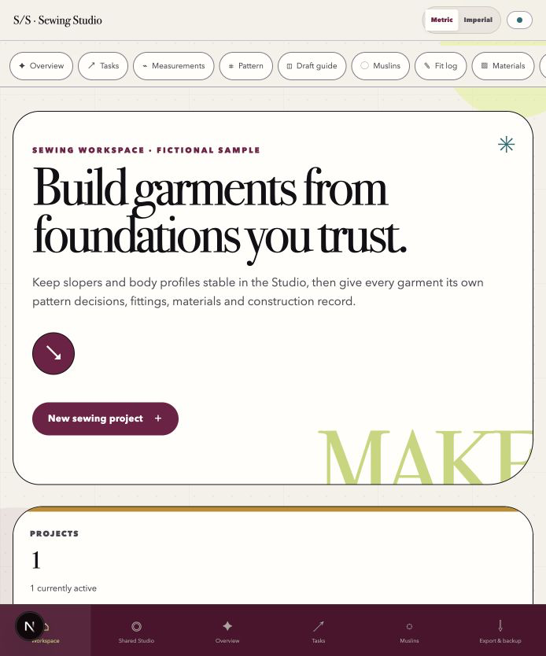
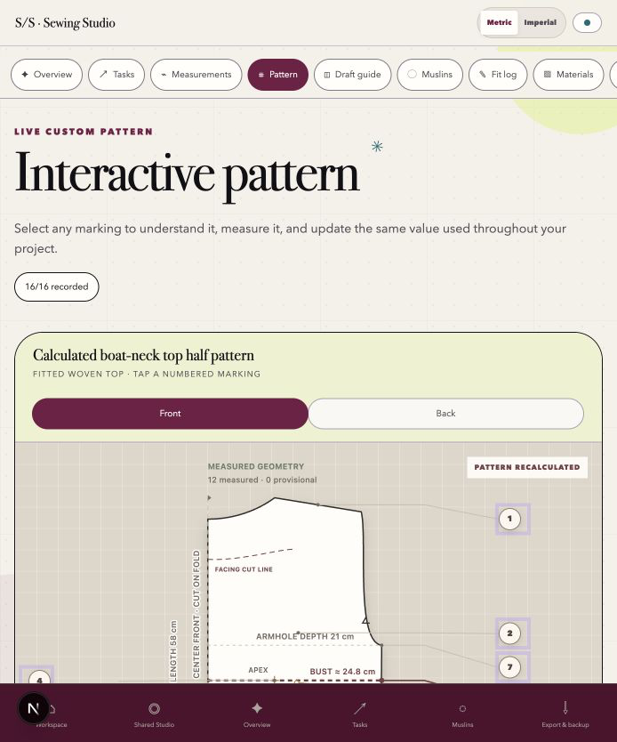
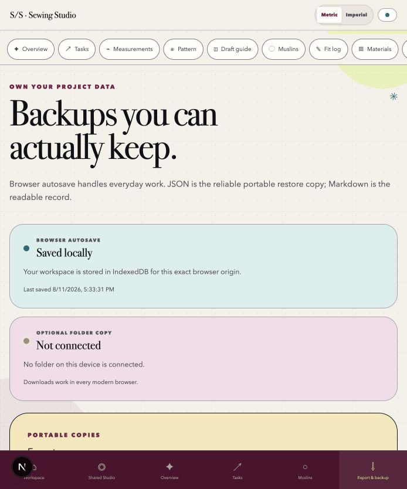

# Sewing Studio

[](https://github.com/shivanigupta-dev/sewing-studio/actions/workflows/ci.yml)
[](LICENSE)
[](docs/privacy.md)

Sewing Studio is a local-first workspace for measurements, reusable slopers, garment plans, pattern versions, muslin evidence, materials, and construction progress. It is designed for a person at a cutting table—not for a project-management department.

The interface is a dreamy editorial pattern room: dusty chartreuse, plum-burgundy, blush, peacock, lavender, ochre, warm paper, oversized serif type, rounded work surfaces, and small celestial marks. The application works without an account, analytics service, or hosted database.

> **Development disclosure:** this is openly a vibe-coded project. Shivani Gupta directs the product, sewing workflow, information architecture, and visual judgment; AI-assisted development tools have contributed implementation, testing, and documentation. Generated code is reviewed and tested, but the pattern engine remains a drafting aid—not a substitute for a muslin or advice from an experienced pattern maker.



| Interactive pattern | Portable backup workflow |
| --- | --- |
|  |  |

**Video walkthrough:** the release recording will show the complete sample flow without real body measurements or private project notes. See the [media capture guide](docs/media-capture.md) for the exact 60-second script, dimensions, privacy check, and GitHub upload steps.

## Start here: clone → run → choose a data home

### 1. Clone the repository

```bash
git clone https://github.com/shivanigupta-dev/sewing-studio.git
cd sewing-studio
```

### 2. Run it locally

#### Easiest production-style setup: Docker

Install [Docker Desktop](https://www.docker.com/products/docker-desktop/) on macOS or Windows, or Docker Engine with Compose on Linux, then run:

```bash
docker compose up --build
```

Open **http://127.0.0.1:3000**. Keep using that exact address because browser storage is tied to its hostname and port. Stop the site with:

```bash
docker compose down
```

Docker serves a static build. The container does not hold your sewing data; the browser does.

#### Native development setup: mise

Install [mise](https://mise.jdx.dev/), then run:

```bash
mise trust
mise install
mise run setup-dev
mise run dev
```

Open **http://127.0.0.1:3000**. On macOS, you can instead double-click **Start Sewing Studio.command**.

Without mise, install Node 24 and Corepack, then use:

```bash
corepack enable
pnpm install --frozen-lockfile
pnpm dev --port 3000
```

The exact Node and pnpm versions are pinned in `mise.toml`, `.nvmrc`, `.node-version`, `package.json`, and the lockfile.

### 3. Choose where portable copies live

Browser autosave starts immediately. It is convenient working storage, but it is not a backup. Open **Export & backup** and choose one of these approaches:

| Destination | Setup | What Sewing Studio does |
| --- | --- | --- |
| Local folder | Select **Choose backup folder** in a supported Chromium browser. | Maintains `sewing-studio-latest.json` and one dated JSON copy per day in the folder you approve. |
| Obsidian vault | Choose a private subfolder such as `My Vault/Sewing Studio/Backups`. | Writes restorable JSON there. Markdown exports can be placed elsewhere in the vault as readable project notes. |
| Google Drive | Install Google Drive for desktop and choose a synced folder such as `My Drive/Sewing Studio/Backups`. | Writes to the local synced folder; Google Drive handles cloud synchronization. The app never receives Google credentials. |
| Any cloud provider | Download **Complete JSON backup**, then move it into Drive, Dropbox, iCloud, Box, or another private location. | Uses normal browser downloads, which work even when direct folder access is unavailable. |

Direct folder access is a progressive browser feature. Safari and Firefox users should use JSON downloads. Do not place body measurements or fitting notes in a public or shared vault.

### 4. Verify the restore path once

1. Export **Complete JSON backup**.
2. Confirm the `.json` file exists and is not empty.
3. Open **Export & backup → Choose JSON backup**.
4. Review the validation summary.
5. Confirm the all-or-nothing replacement only when you intend to restore.
6. Export again after the restore to prove the workspace remains portable.

That short rehearsal is the best way to know a backup system works before a real fitting record depends on it.

## Where data lives

Each browser origin stores one versioned `WorkspaceState` document in IndexedDB. The application sends no workspace data to a server.

- `http://127.0.0.1:3000` and `http://localhost:3000` are different storage origins.
- Changing protocol, hostname, port, or deployment domain creates a new storage boundary.
- Removing a Docker container normally leaves browser data intact when the origin stays the same.
- Clearing browser data can erase autosave.
- JSON is the canonical, re-importable backup.
- Markdown and CSV are readable exports, not restore formats.

Treat exports as sensitive because they may contain measurements, fitting observations, and project notes. Read the [privacy and publication audit](docs/privacy.md) before sharing a fork.

## Current features

- First-run choice between a clearly labeled fictional sample and a blank workspace
- Multiple independent garment projects
- Shared measurement profiles and reusable bodice slopers
- Fitted bodice drafting tutorial with metric and sewing-fraction conversion
- Interactive front/back pattern geometry with live calculated markings
- Project-specific measurement snapshots and explicit profile synchronization
- Pattern versions with draft, tested, accepted, and retired states
- Muslin iterations, durable pattern decisions, and fitting-session notes
- Fabric, notions, construction notes, and safe URL references
- Dependency-aware construction stories and a visible next action
- Automatic IndexedDB persistence and visible save status
- Validated JSON import/export with stable IDs
- Project Markdown, workspace Markdown, and CSV exports
- Optional user-approved folder copies
- Static and offline-capable production build
- Responsive layout, keyboard focus, sufficient contrast, and reduced-motion support

## Sewing scope and limitations

The fitted bodice and boat-neck geometry encode useful drafting invariants, but Sewing Studio is not yet a production pattern system.

- Always make and fit a muslin before cutting valuable fabric.
- Confirm dart position, balance, ease, neckline, armholes, grain, and seam matching on the body.
- Do not treat the on-screen geometry as print-scaled output.
- The current formulas need continued review across body proportions and fitting practices.
- The fictional sample is demonstration data, not a size standard.

Sewing-practice refinement is an explicit next phase of the project. Useful contributions include cited drafting references, reproducible fitting cases, and synthetic test measurements.

## Architecture in one minute

Sewing Studio uses React 19, TypeScript, and Next.js 16 conventions. `next build` emits static files into `out/`; no application server, database, secret, or environment variable is required at runtime.

```text
measurement profile ──┐
                      ├── reusable sloper ──┐
techniques + notes ───┘                     ├── garment project
                                            ├── pattern versions
                                            ├── muslins + fit sessions
                                            └── tasks + materials + references
```

Canonical measurements, configuration, notes, and stable record IDs are persisted. Derived calculations and SVG geometry are reproduced at runtime and are deliberately omitted from backups.

See [architecture](docs/architecture.md), [data model](docs/data-model.md), and the [JSON backup contract](contracts/sewing-studio-backup.schema.json).

## Repository structure

```text
app/                  React views, pattern canvas, and visual system
contracts/            Portable JSON backup schema
docs/                  Architecture, deployment, privacy, and release media
examples/              Synthetic public-safe examples
lib/                   Workspace model, calculations, persistence, and exporters
public/                Favicon and offline service worker
scripts/               Development and localhost verification
tests/                 Model, conversion, import, export, and shell tests
Dockerfile             Multi-stage static production image
docker-compose.yml     Production and optional developer services
mise.toml              Pinned tools and common development tasks
```

## Development and verification

Run the complete native gate:

```bash
mise run check
```

With the normal development server stopped, verify that a temporary server works through both loopback names:

```bash
mise run verify-dev
```

Individual commands are also available:

```bash
pnpm lint
pnpm typecheck
pnpm test
pnpm build
pnpm audit:prod
```

To inspect the production static output locally:

```bash
pnpm build
pnpm start
```

The generated site is written to `out/`.

### Docker development profile

The optional source-mounted developer container runs at **http://127.0.0.1:3001**:

```bash
docker compose --profile dev up sewing-studio-dev --build
```

On Windows, keeping the repository in the WSL filesystem makes source-mounted development faster.

## Deploy independently

Any static host can serve `out/`. The repository includes a manual GitHub Pages workflow with narrowly scoped deployment permissions.

### GitHub Pages

1. In the repository, open **Settings → Pages**.
2. Set **Source** to **GitHub Actions**.
3. Open **Actions → Deploy static site to GitHub Pages**.
4. Select **Run workflow**.
5. Open the URL reported by the completed deployment.
6. Import JSON from the prior origin if you are moving an existing workspace.

### Generic static hosting

```bash
pnpm install --frozen-lockfile
pnpm build
```

Upload the contents of `out/` to Netlify, Cloudflare Pages, an S3-compatible static host, or any conventional web server. Configure an `index.html` fallback if the host requires it.

Deployment creates a new browser-storage origin for every visitor. There is no shared server workspace: each person owns their data and migrates it with JSON.

See [deployment](docs/deployment.md) for additional hosting notes.

## Add a garment project

1. Open **Workspace → New sewing project**.
2. Choose a garment type, measurement profile, and optional starting sloper.
3. Give the garment a title, design intent, and next action.
4. Use Pattern, Muslins, Fit log, Materials, and Project plan as the garment evolves.

Each garment receives its own measurement snapshot. Later profile edits do not silently rewrite an in-progress project.

## Add or modify a sloper

Open **Shared Studio → Slopers**. A sloper belongs to the workspace rather than one garment. Record its measurement profile, kind, status, drafting notes, and validation tasks there. Create a garment project from the sloper instead of editing the reusable master for a style-specific change.

## Publication media

All repository media must use the fictional sample. Never capture browser tabs, bookmarks, real measurements, fitting photographs, local folder names, or private notes.

The [media capture guide](docs/media-capture.md) defines:

- the three desktop screenshots and two mobile screenshots to replace
- the exact 60-second walkthrough flow
- macOS screenshot and screen-recording steps
- recommended dimensions, H.264 settings, and file-size target
- how to attach a video to GitHub without bloating Git history

Replacing the documented filenames updates the README automatically because GitHub resolves relative image paths against the current branch.

## Troubleshooting

**The browser says the site cannot be reached.** Keep the terminal or Docker service running. Open exactly `http://127.0.0.1:3000`.

**Projects appear missing.** Check whether the address changed between `localhost` and `127.0.0.1`, or whether the port, protocol, or deployed domain changed. Return to the original origin or import JSON.

**The folder button is unavailable.** Direct folder writing is not supported in every browser. Use **Complete JSON backup** and move the download manually.

**A Google Drive folder is not selectable.** Install Google Drive for desktop so the destination exists as a local folder, or upload the downloaded JSON through drive.google.com.

**An Obsidian vault does not appear.** Confirm the vault is stored locally rather than available only through a mobile/cloud interface, then select a private subfolder.

**An import is rejected.** Keep the original file, read every validation error, and verify that it is an unmodified Sewing Studio JSON backup under 5 MB. Import never partially applies.

**The development verification says another server is running.** Stop the normal `pnpm dev` process before running `pnpm verify:dev`; Next.js permits only one development server per project directory.

## Known limitations and roadmap

- IndexedDB is convenient storage, not a guaranteed backup.
- Direct folder copies are not supported by every browser.
- Google Drive and Obsidian work through local folders; there is no provider API integration.
- Markdown and CSV cannot be imported.
- Project images are URL references; files are not embedded in backups.
- JSON restore replaces the workspace; merge import is deferred.
- Pattern geometry is not print-scaled or tiled.
- Additional sloper families, sleeves, skirts, trousers, and jackets need domain review.
- Automated accessibility and visual-regression coverage can be expanded.
- The offline worker is basic and does not yet offer an installable-app prompt.

## Contributing and security

Read [CONTRIBUTING.md](CONTRIBUTING.md) before changing schemas, drafting formulas, or fixtures. Report data-loss, unsafe import, XSS, dependency, or accidental-data-exposure problems using GitHub’s private vulnerability-reporting flow as described in [SECURITY.md](SECURITY.md).

Sewing Studio is available under the [MIT License](LICENSE). See [CHANGELOG.md](CHANGELOG.md) for release history.
